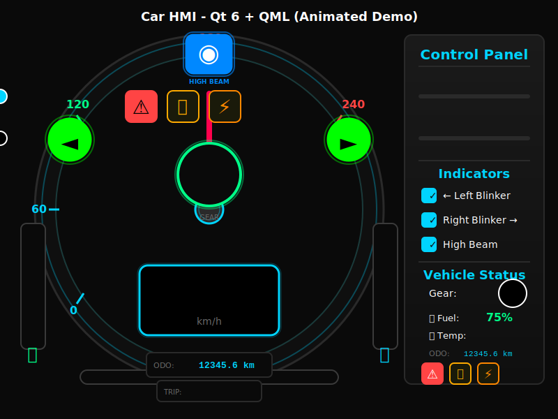

# Car HMI with Cursor

A professional automotive cluster HMI simulation built with Qt 6 and QML, featuring a speedometer, tachometer, gear indicator, fuel/temperature gauges, turn signals, high beam, and warning lights with stunning glow effects and smooth animations.

## 🎬 Demo

<p align="center">
  
</p>

<p align="center">
  <em>🎨 Animated representation of the car HMI cluster interface</em><br/>
  <sub>Watch the needle move, indicators blink, and values change in real-time! ✨</sub>
</p>

### Live Application Features
The SVG above shows the interface layout. When you run the actual application, you'll see:
- **Smooth animations** - Real-time needle movement at 30 FPS
- **Color transitions** - Dynamic RPM bar that changes from green → yellow → red
- **Pulsing indicators** - Animated turn signals and warning lights
- **Live data updates** - Fuel consumption, temperature changes, distance tracking
- **Interactive controls** - Real-time response to slider movements

> 🎥 **Want to see it in action?** 
> 
> 1. Build and run: `cd build && ./car-hmi-with-cursor.app/Contents/MacOS/car-hmi-with-cursor`
> 2. Create screenshots/GIF: `./create_demo.sh`

<!-- Uncomment when you have created the demo GIF:

-->

### Live Demo Features
- **Real-time Speed Gauge** - Smooth needle animation (0-240 km/h)
- **Dynamic RPM Bar** - Color transitions (green → yellow → red)
- **Automatic Gear Shifting** - Speed-based gear changes (P/1-6)
- **Animated Indicators** - Pulsing turn signals and warnings
- **Live Telemetry** - Fuel consumption, temperature, distance tracking

> **📸 Want to create your own demo?** 
> 
> Run the included script: `./create_demo.sh`
> 
> Or see detailed instructions in [docs/CREATE_DEMO.md](docs/CREATE_DEMO.md)

## Features

### 🎨 Professional Automotive Cluster
- **Circular Speed Gauge**: 0-240 km/h with animated needle and color-coded scale markings
- **Digital Speed Display**: Real-time speed readout with glow effects
- **RPM Bar**: Color-coded tachometer with gradient (green → yellow → red)
- **Gear Indicator**: Large, prominent gear display (P/1/2/3/4/5/6)
- **Fuel Gauge**: Vertical bar with percentage indicator
- **Temperature Gauge**: Coolant temperature display (70-120°C)
- **Odometer & Trip Meter**: Distance tracking with live updates

### 🎯 Visual Effects
- **Glow Effects**: Multi-layer shadows on indicators and gauges
- **Gradient Backgrounds**: Professional depth and dimensionality
- **Smooth Animations**: 30Hz update rate with interpolation
- **Pulsing Alerts**: Warning lights blink when active

### 🚦 Indicators & Warnings
- **Turn Signals**: Animated left/right blinkers with pulse animation
- **High Beam Indicator**: Visual feedback with glow effect
- **Engine Warning**: RPM > 7000 triggers alert
- **Oil Warning**: Temperature > 110°C triggers alert
- **Fuel Warning**: Fuel < 10% triggers alert

### 🎮 Interactive Control Panel
- **Speed & RPM Sliders**: Real-time control with smooth interpolation
- **Indicator Checkboxes**: Toggle blinkers and high beam
- **Live Status Display**: Shows gear, fuel, temperature, odometer, trip meter, and warnings
- **Dark Automotive Theme**: Modern UI with cyan accents

## Technical Details

- **Framework**: Qt 6.5+
- **Build System**: CMake
- **Language**: C++ (backend), QML (UI)
- **Update Rate**: ~30 Hz for smooth animations
- **MockCan Class**: Simulates CAN bus data with smooth interpolation

## Project Structure

```
car-hmi-with-cursor/
├── CMakeLists.txt           # CMake build configuration
├── app/
│   └── main.cpp             # Application entry point
├── signals/
│   ├── MockCan.h            # Mock CAN bus header
│   └── MockCan.cpp          # Mock CAN bus implementation
└── ui/
    ├── Main.qml             # Main window with control panel
    └── components/
        └── SpeedCluster.qml # Speedometer cluster component
```

## Requirements

- Qt 6.5 or later
- CMake 3.16 or later
- C++17 compatible compiler
- Qt modules: Core, Gui, Qml, Quick

## Building

### macOS/Linux

```bash
mkdir build
cd build
cmake ..
cmake --build .
./car-hmi-with-cursor
```

### Windows

```bash
mkdir build
cd build
cmake ..
cmake --build . --config Release
.\Release\car-hmi-with-cursor.exe
```

## Usage

1. **Launch the application**: Run the executable after building
2. **Control Speed**: Use the speed slider (0-240 km/h)
3. **Control RPM**: Use the RPM slider (0-8000)
4. **Toggle Indicators**:
   - Left/Right Blinker: Check the corresponding boxes (blinks at ~2 Hz)
   - High Beam: Check the high beam box

The gauges will smoothly animate to the target values with realistic oscillations.

## MockCan Class

The `MockCan` class provides:
- **Q_PROPERTY**: Exposes speed, rpm, gear, fuel, temperature, odometer, trip meter, blinkers, high beam, and warnings to QML
- **30 Hz Updates**: Smooth value interpolation with realistic oscillations
- **Automatic Gear Shifting**: Speed-based gear calculation (P/1-6)
- **Fuel Consumption**: Realistic fuel depletion based on speed
- **Temperature Simulation**: Engine temperature varies with RPM
- **Distance Tracking**: Odometer and trip meter increment with speed
- **Warning System**: Automatic alerts for high RPM, temperature, and low fuel
- **Blinker Animation**: 500ms toggle rate for turn signals
- **Value Clamping**: Ensures values stay within realistic ranges

## Customization

### Modify Speed Range

Edit `SpeedCluster.qml`:
```qml
var normalizedSpeed = Math.min(Math.max(root.speed, 0), 240);
```

### Change Update Rate

Edit `MockCan.cpp`:
```cpp
m_updateTimer->start(33); // 33ms = ~30Hz
```

### Adjust Colors

Colors are defined in QML files using hex values:
- Cyan accent: `#00d4ff`
- Speed needle: `#ff0044`
- Background: `#0a0a0a`

## License

This is a demonstration project created for educational purposes.

